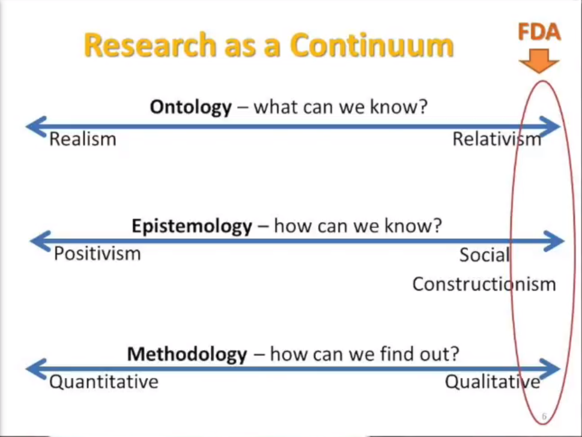

# Readings

## The Belmont Report (1979)

Office of the Secretary (1979). The Belmont Report. [hhs.gov](https://www.hhs.gov/ohrp/sites/default/files/the-belmont-report-508c_FINAL.pdf) [the-belmont-report-508c_FINAL.pdf](the-belmont-report-508c_FINAL).

> This link will take you to the original Belmont Report that is a seminal document outlining ethical principles and guidelines on research involving human subjects.

## Discourse Ethics to Value Sensitive Design (2011)

Yetim, F. (2011). Bringing discourse ethics to value sensitive design: Pathways toward a deliberative future. AIS Transactions on Human Computer Interaction 3(2), 133-155. [aisnet](https://aisel.aisnet.org/cgi/viewcontent.cgi?article=1030&context=thci).  [DiscourseEthics](DiscourseEthics.pdf).

## Issues and Research Challenges in Sequential Pattern Mining (2020)

Nagori, S., & Kumar Soni, H. (2020). Issues and Research Challenges in Sequential Pattern Mining. 2020 IEEE International Conference on Advances and Developments in Electrical and Electronics Engineering (ICADEE), Advances and Developments in Electrical and Electronics Engineering (ICADEE), 2020 IEEE International Conference On, 1–7. [doi](https://doi-org.proxy1.ncu.edu/10.1109/ICADEE51157.2020.9368943). [PatternMatching.pdf](PatternMatching.pdf).

This article goes into detail about the challenges with implementing pattern matching.  While very interesting, its not applicable to this assignment.

## Ethics Events and Conditions of Possibility (2021)

Tan, Z. (Simon). (2021). Ethics Events and Conditions of Possibility: How Sell-Side Financial Analysts Became Involved in Corporate Governance. Business Ethics Quarterly, 31(1), 106–137. [EBSCO](https://search-ebscohost-com.proxy1.ncu.edu/login.aspx?direct=true&db=edb&AN=147839336&site=eds-live) [EthicsEvents](EthicsEvents.pdf).

This article outlines several interesting challenges; specifically, (Foucauldian-centric):

- Conflict of Interest
- Mortal standards
- Legality grey zones
- Agenda

## A Hands-on introduction to thatic analysis (2017)

Owen, Craig (2017). A Theorical Hands-on introduction to Fouculdian Discourse analysis. [YouTube](https://www.youtube.com/watch?v=6I6b3ePAZ5M).

Language (e.g., verbal and visual) 'constructs' relatity.  Look at what people are duing with their talk.  What is the effect, consequences, and function of their words inflecting.

### Who is Michel Foucault

Michel Foucault, the French social theorist, was particularly interested in how processes of classification and categorization proliferated during and following the enlightenment period (17th Century).  Foucault (1977, 1979) points to how this proliferation was closely tied to changes in society, notably the expansion of the population and growing urbanization and industrialization. Such changes prompted the necessity for more effective forms of what Foucault termed “governance” – which refers to all the ways through which populations are regulated and governed.  Foucault argues that these governance processes were directly responsible for producing categories of “being” that we all take for granted in our current epoch, such as academic ability; mental stability; sexual orientation and so forth.  The point he makes is not that these categories did not exist prior to this time, but rather, similar to the example of body size above, they became central and defining characteristics of modern personhood for particular reasons at a particular time.  Specifically, contemporary categories of being are closely aligned with the needs of a capitalist economy and the need for individuals to be productive in both a biological and physical sense (see Rose, 1990; 1996).

### What is social constructionism (Burr, 2015, ch. 1)

> Vivien Burr. (2015). Social Constructionism: Vol. Third edition. Routledge. [BurrDickChapterrevised1](BurrDickChapterrevised1.docx).

Paradigm, a world view, general framework of assumptions.  It's not possible to have unbias positions because we have historical and cultural defaults.

Knowledge is sustained by social processes.  Our constructions of the world enable and contrain action.

Social justice defines the laws, but the laws change between locations and times.

### How do different perspectives influence answers (Gergen, 2010)

> Gergen (Sept, 2010). Ken Gergen talks about Social Constructionist Ideas, Theory and Practice. The Taos Institute. [Vimeo](https://vimeo.com/15676699).
> Constructionist theory and practice locates the source of meaning, value and action in the relational connection among people. It is through relational processes that we create the world in which we most want to live and work.

Within this video Ken asks what we would call "a bottle of water."  As we assign 'truths' to it, our perspective narrows and it pulls in additional expectations and norms.  The bottle doesn't exist within physics, so we need a different label.  Then consider the differences between an art student and environmentalist, where one finds it stylist versus destructive.  `We socially construct what its and that infers its values`.

This means that communities have contraints that they apply predictions and research methodologies.  For instance, a religion could be built around the bottle (e.g., batism), and therefore it would not be appropriate to call it an "abomination"
