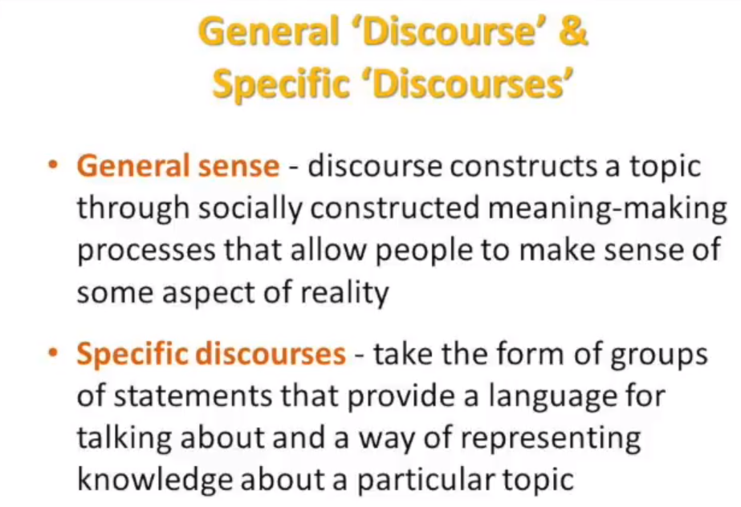
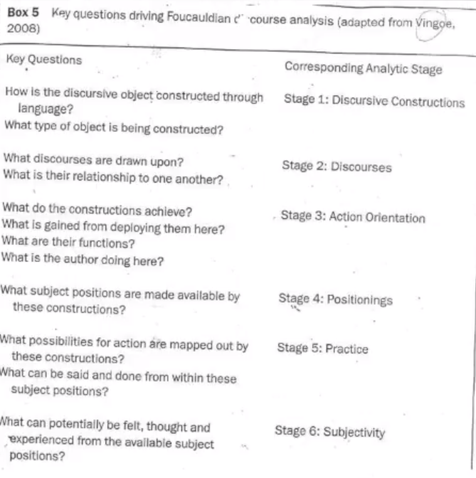

# Readings

## The Belmont Report (1979)

Office of the Secretary (1979). The Belmont Report. [hhs.gov](https://www.hhs.gov/ohrp/sites/default/files/the-belmont-report-508c_FINAL.pdf) [the-belmont-report-508c_FINAL.pdf](the-belmont-report-508c_FINAL).

> This link will take you to the original Belmont Report that is a seminal document outlining ethical principles and guidelines on research involving human subjects.

It was the summer of 1972 when a stunned nation first learned of the infamous Tuskegee Syphilis Study, during which hundreds of poor, diseasestricken black men from Macon County Alabama, had been deliberately left untreated for 40 years. Coming on the heels of multiple, earlier examples of
unethical human experimentation, the Tuskegee Syphilis Study made it plain that the moral foundation of human subject research was in desperate need of repair. Blind reliance on the Nuremberg Code and the Declaration of Helsinki was no longer going to suffice. It was against this backdrop
that Congress resolved to act. Numerous hearings and multiple spirited discussions later, an agreement was struck to constitute the "Commission." The
outgrowth of a retreat held at the Smithsonian Institution’s Belmont Conference Center, the Belmont Report lays out a principled analytical framework to "guide the resolution of ethical problems arising from research involving human subjects."

### What are the three principals

The Belmont Report summarizes ethical principles and guidelines for research involving human subjects. Three core principles are identified: `respect for persons, beneficence, and justice`.

## The Belmont Report at 40: Reckoning With Time (2018)

Adashi, E. Y., Walters, L. B., & Menikoff, J. A. (2018). The Belmont Report at 40: Reckoning With Time. American Journal of Public Health, 108(10), 1345–1348. [EBSCO](https://search-ebscohost-com.proxy1.ncu.edu/login.aspx?direct=true&db=s3h&AN=131743373&site=eds-live). [Belmost_40yrs_later](Belmost_40yrs_later.pdf).

Essentially, the Belmont Report says that "the Commission took the view that risk-laden, albeit promising research, may not be justified merely on the strength of its potential social benefits [...] rejected the notion of "for the greater good of the greater number" as an ethical rationale for
the conduct of risk-encumbered, if auspicious, research. In subscribing to the foregoing positions, the Commission reflected widely held sentiments of its time according to which "scientific research must be supported. It must be encouraged. But it must go forth with the minimal possible risk to research subjects."

However, it also makes a distinction between research and practice of medicine.  There is also critism that its three principals are too abstract, at best an "analytical framework."

> Some of the more penetrating questions that have been raised concern the judgement of the Commission in placing protectionism ahead of utilitarianism and individualism ahead of communitarianism. These concerns, first illustrated by the HIV/AIDS epidemic, fault the Report for excluding marginalized, often disempowered and resource-poor communities that are now desirous of participation in research.18,19 Additional concerns have focused on the lack of emphasis on transparency, the relevance of which to the commercialization of present-day research is self-evident. The absence of the all-important
feminist perspective has been similarly lamented.21 Lastly, it has been noted that the research–practice distinction in presentday learning health care systems is disappearing, for which a novel framework was originally proposed.

## The Ethics of Research That May Disadvantage Others (2021)

Robertson, C. (2021). The Ethics of Research That May Disadvantage Others. Ethics & Human Research, 43(1), 2–16. [doi](https://doi-org.proxy1.ncu.edu/10.1002/eahr.500074). [EthicsResearchDisadvantage](EthicsResearchDisadvantage.pdf).

The authors frame the problem within the medical community.  Historically, researchers exclude "non-white males" from their study group, which raises questions toward the accuracy of results.  However, this also means that treatments are easier to release due to sampling bias.

Many procedures "just work out" so it raises more questions around the value of inclusion.  Specifically, should the additional studies occurred, before coming to the same conclusion?  This is a double edge sword, as people would die during that time.

> A particular provision in the Common Rule reflects this insight. “The IRB should not consider possible long-range effects of applying knowledge gained in the research … as among those research risks that fall within the purview of its responsibility”. Accordingly, Hausman explains that the IRB `must focus on the risks of the research process itself, not “outcome-related risks.” The fact that Adam may go on to get a ventilator or win an A-grade or discharge a debt is precisely this sort of downstream consequence that is beyond the purview of ethical gatekeeping, even if the regulator had a preference as to that outcome`."

### Considering the distinction of harm and setback

> Let us now address this concern that normal principles of equipoise do not apply to special cases where the research project may actually impose a relative disadvantage on those not treated. `It is not just that Bert does not receive the treatment he wants, but when other people receive it they make him worse off` (reducing his chances of getting the ventilator or the grade of A or the full claimed value of the debt). The answer is that Bert is not actually harmed. `Without alleging harm, Bert has no basis to object to Adam or the scientists pursuing their own agendas`.
>It is true that Adam’s participation sets back Bert’s interests. However, there is a key distinction between a harm and a mere setback to interests. Building on a concept developed by John Stuart Mill, philosopher Joel Feinberg has clarified this relationship. `A “harm” is a “wrongful setback to interests” (emphasis added). Generally, harms (not mere setbacks) are the proper focus of regulation that would restrict liberties`.
> After all, `setbacks to interest are ubiquitous`. If I prefer that Charlie win the election, but you vote for Davis, then you set back my interests. If I am hoping to get a coveted job, but you submit your stellar resume, then you set back my interests. If am hoping to get an A in a curved school class, but you spend extra time studying, you set back my interests. If I need a ventilator, but you get an investigational drug that gives you a better prognosis, you set back my interests. If I am wanting to collect $10,000 for the debt, but you go to court and get a judgment allowing
me to recover only $1,000, then you set back my interests.

## Discourse Ethics to Value Sensitive Design (2011)

Yetim, F. (2011). Bringing discourse ethics to value sensitive design: Pathways toward a deliberative future. AIS Transactions on Human Computer Interaction 3(2), 133-155. [aisnet](https://aisel.aisnet.org/cgi/viewcontent.cgi?article=1030&context=thci).  [DiscourseEthics](DiscourseEthics.pdf).

## Issues and Research Challenges in Sequential Pattern Mining (2020)

Nagori, S., & Kumar Soni, H. (2020). Issues and Research Challenges in Sequential Pattern Mining. 2020 IEEE International Conference on Advances and Developments in Electrical and Electronics Engineering (ICADEE), Advances and Developments in Electrical and Electronics Engineering (ICADEE), 2020 IEEE International Conference On, 1–7. [doi](https://doi-org.proxy1.ncu.edu/10.1109/ICADEE51157.2020.9368943). [PatternMatching.pdf](PatternMatching.pdf).

This article goes into detail about the challenges with implementing pattern matching.  While very interesting, its not applicable to this assignment.

## Ethics Events and Conditions of Possibility (2021)

Tan, Z. (Simon). (2021). Ethics Events and Conditions of Possibility: How Sell-Side Financial Analysts Became Involved in Corporate Governance. Business Ethics Quarterly, 31(1), 106–137. [EBSCO](https://search-ebscohost-com.proxy1.ncu.edu/login.aspx?direct=true&db=edb&AN=147839336&site=eds-live) [EthicsEvents](EthicsEvents.pdf).

This article outlines several interesting challenges; specifically, (Foucauldian-centric):

- Conflict of Interest
- Mortal standards
- Legality grey zones
- Agendas
- Professional Codes

Consider:

> Over time, analysts have become obsessed with the question of whether a company meets its quarterly EPS numbers, and not with whether a company is built to last … this shift from long-term-thinking to short-term results has echoed through to company managements and to professional investors. The focus on short-term results has … had a counterproductive influence on companies, on investors and on analysts themselves. (pg. 114)

The analysts are ethical, yet they are not acting in the clients best interest.

## A Hands-on introduction to thatic analysis (2017)

Owen, Craig (2017). A Theorical Hands-on introduction to Fouculdian Discourse analysis. [YouTube](https://www.youtube.com/watch?v=6I6b3ePAZ5M).

Language (e.g., verbal and visual) 'constructs' relatity.  Look at what people are duing with their talk.  What is the effect, consequences, and function of their words inflecting.

### Who is Michel Foucault

Michel Foucault, the French social theorist, was particularly interested in `how processes of classification and categorization proliferated during and following the enlightenment period` (17th Century).  Foucault (1977, 1979) points to how this proliferation was closely tied to changes in society, notably the expansion of the population and growing urbanization and industrialization. Such changes prompted the necessity for more effective forms of what Foucault termed "governance" – which refers to all the ways through which populations are regulated and governed.  Foucault argues that these governance processes were directly responsible for producing categories of "being" that we all take for granted in our current epoch, such as academic ability; mental stability; sexual orientation and so forth.  The point he makes is not that these categories did not exist prior to this time, but rather, similar to the example of body size above, they became central and defining characteristics of modern personhood for particular reasons at a particular time.  Specifically, contemporary categories of being are closely aligned with the needs of a capitalist economy and the need for individuals to be productive in both a biological and physical sense (see Rose, 1990; 1996).

### What is social constructionism (Burr, 2015, ch. 1)

> Vivien Burr. (2015). Social Constructionism: Vol. Third edition. Routledge. [BurrDickChapterrevised1](BurrDickChapterrevised1.docx).

Paradigm, a world view, general framework of assumptions.  It's not possible to have unbias positions because we have historical and cultural defaults.

Knowledge is sustained by social processes.  Our constructions of the world enable and contrain action.

Social justice defines the laws, but the laws change between locations and times.

### How do different perspectives influence answers (Gergen, 2010)

> Gergen (Sept, 2010). Ken Gergen talks about Social Constructionist Ideas, Theory and Practice. The Taos Institute. [Vimeo](https://vimeo.com/15676699).
> Constructionist theory and practice locates the source of meaning, value and action in the relational connection among people. It is through relational processes that we create the world in which we most want to live and work.

Within this video Ken asks what we would call "a bottle of water."  As we assign 'truths' to it, our perspective narrows and it pulls in additional expectations and norms.  The bottle doesn't exist within physics, so we need a different label.  Then consider the differences between an art student and environmentalist, where one finds it stylist versus destructive.  `We socially construct what its and that infers its values`.

This means that communities have contraints that they apply predictions and research methodologies.  For instance, a religion could be built around the bottle (e.g., batism), and therefore it would not be appropriate to call it an "abomination"

### What is discourse

- A group of statements which provide a language for talking about -- a way of representing the knowledge about -- a particular topic at a particular historical momembet." (Hall, 1992, p.291)

- Discourse never consists of one statement, one text, one action or one source.  The same discourse... will appear across a range of texts, and as forms of conduct, at a number of different institutional sites within society (Hall, 1997,p.44)

### What is power

- Power is not fixed and held by groups
- Relation between forces, so where this is power there is resistence
- Expose implicit values and hidden assumptions underpinning taken for granted knowledge

### How do I perform Foucauldian Discourse Analysis (FDA)

## Post-Foucauldian Discourse and Dispositif Analysis in the Post-Socialist Field of Research (2021)

Nowicka-Franczak, M. (2021). Post-Foucauldian Discourse and Dispositif Analysis in the Post-Socialist Field of Research: Methodological Remarks. Qualitative Sociology Review, 17(1), 72–95. [EBSCO](https://search-ebscohost-com.proxy1.ncu.edu/login.aspx?direct=true&db=edo&AN=148691756&site=eds-live). [PostFoucouldian.pdf](PostFoucouldian.pdf).
