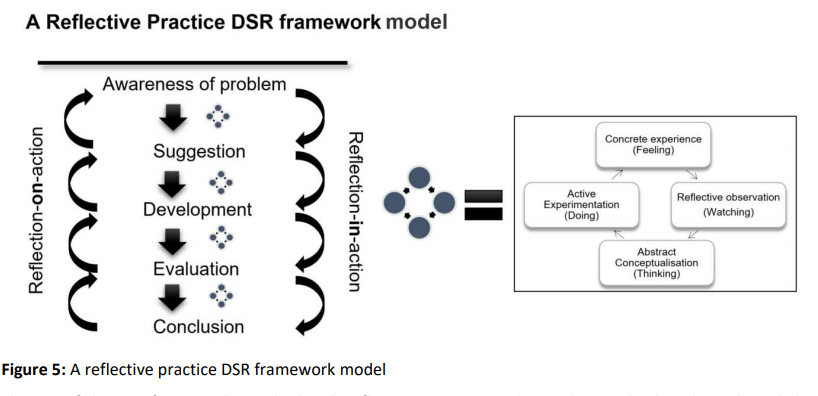

# Readings

## Constructive Research Approach in Project Management Research (2011)

Oyegoke, A. (2011). The constructive research approach in project management research. International Journal of Managing Projects in Business, 4(4), 573-595. [doi](http://dx.doi.org.proxy1.ncu.edu/10.1108/17538371111164029). [ProjectManagementResearch](ProjectManagementResearch.pdf).
> Review this study for an example of constructive research questions.

## Managing Omnichannel Capabilities: A Design Science Research Approach (2019)

Wulf, J. (2019). Development of an AHP hierarchy for managing omnichannel capabilities: a design science research approach. Business Research, 1-30. doi:10.1007/s40685-019-0095-5. [OmniChannelCapabilities](OmniChannelCapabilities.pdf).
>Review this study for an example of constructive research questions.

## Knowledge Generation in Design Science Research (2019)

van Rensburg, J. J., & Goede, R. (2019). A model for improving knowledge generation in design science research through reflective practice. Electronic Journal of Business Research Methods, 17(4), 192-211. DOI 10.34190/JBRM.17.4.001.
This paper addresses the research question, "How can we make the process of obtaining knowledge in DSR more explicit?" [KnowledgeGeneration](KnowledgeGeneration.pdf).

.

## The DevOps Reference Architecture Evaluation (2020)

G. B. Ghantous and A. Gill, "The DevOps Reference Architecture Evaluation : A Design Science Research Case Study," 2020 IEEE International Conference on Smart Internet of Things (SmartIoT), 2020, pp. 295-299, doi: 10.1109/SmartIoT49966.2020.00052. [DevOps.pdf](DevOps.pdf).
> Need and problem: A multi-cloud environment for software development and deployment that meets the needs of different industry partners. The challenge is how to deploy software applications to multi-cloud.

DigiSAS labs wants to determine if DevOps is the right framework for their organization, provided its: Generalization, Usefulness, Novelty, Coverage, and Reusable.

## Using DSR for Development of a Neutron Monitor (2019)

J. E. W. Holm, "Using Design Science Research for Development of a Neutron Monitor," 2019 IEEE AFRICON, 2019, pp. 1-6, doi: 10.1109/AFRICON46755.2019.9133893. [NeutronMonitor.pdf](NeutronMonitor.pdf).

> Design an autonomous neutron monitor for use in highly remote areas with extreme environmental conditions (-60ºC).

## Exploring the Design Space of Embodied Architectonic Interaction (2020)

Eleni Economidou. 2020. Exploring the Design Space of Embodied Architectonic Interaction. In Companion Publication of the 2020 ACM Designing Interactive Systems Conference (DIS' 20 Companion). Association for Computing Machinery, New York, NY, USA, 509–514. [DOI](https://doi.org/10.1145/3393914.3395826). [DesignSpace.pdf](DesignSpace.pdf).

## Power to the People (2018)

Lindsay Simmonds. 2018. Power to the People: Designing a better prepaid solar electricity service for rural Indian villages. In Proceedings of the 9th Indian Conference on Human Computer Interaction (IndiaHCI'18). Association for Computing Machinery, New York, NY, USA, 80–84. [DOI](https://doi.org/10.1145/3297121.3297134). [PowerMeter.pdf](PowerMeter.pdf).

Indian villagers can use pre-paid energy, however, these programs have low adoption rates.  The researchers build a series of rapid prototypes to uncover why people are not using the program.

They conclude in this thesis summary, that previous designs are overly technical and use foreign languages (e.g., English).  After the necessary design tweaks the utility of the pre-paid energy increased.

## Let's Get Divorced (2018)

~Jodi Forlizzi, John Zimmerman, Paul Hekkert, and Ilpo Koskinen. 2018. Let's Get Divorced: Constructing Knowledge Outcomes for Critical Design and Constructive Design Research. In Proceedings of the 2018 ACM Conference Companion Publication on Designing Interactive Systems (DIS '18 Companion). Association for Computing Machinery, New York, NY, USA, 395–397. [DOI](https://doi.org/10.1145/3197391.3197395). [LetsDivorce](LetsDivorce.pdf).~

This is a flier for a workshop, not a paper.

## Cyber Physical Systems Applications with a Case Study of Intelligent Dispatch of PV (2021)

H. Riggs et al., "Cyber Physical Systems Applications with a Case Study of Intelligent Dispatch of PV," SoutheastCon 2021, 2021, pp. 1-7, doi: 10.1109/SoutheastCon45413.2021.9401943. [CPS_with_IntelligentDispatch](CPS_with_IntelligentDispatch.pdf).

Distributed energy grids encounter intermittent failures and require mechanisms that forecast issues.  However, collecting this information is complex due to the scale and heterogeneous CPS devices available.

The authors ask if modern key-value databases can simplify the collection and promote machine learning-based predictions.

## Analyzing Stance and Topic of E-Cigarette Conversations on Twitter (2021)

C. P. Sari Kaunang, F. Amastini and R. Mahendra, "Analyzing Stance and Topic of E-Cigarette Conversations on Twitter: Case Study in Indonesia," 2021 IEEE 11th Annual Computing and Communication Workshop and Conference (CCWC), 2021, pp. 0304-0310, doi: 10.1109/CCWC51732.2021.9375949. [Ecigarette](Ecigarette.pdf).

Indonesia wants to understand their population's e-cig sentiment. This problem is important because 29% of the country smokes today.

They address this problem by clustering tweets into (R1) Against/Favor/Neutral/Irrelevant.  Next they (R2) use topic models to understand reasons for those positions.
