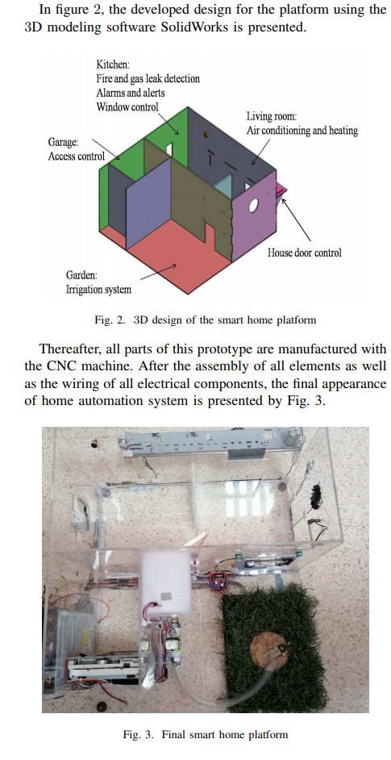
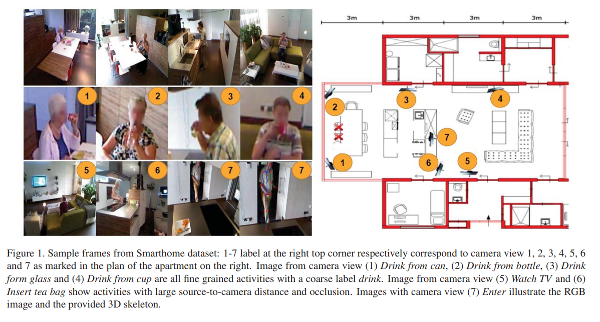
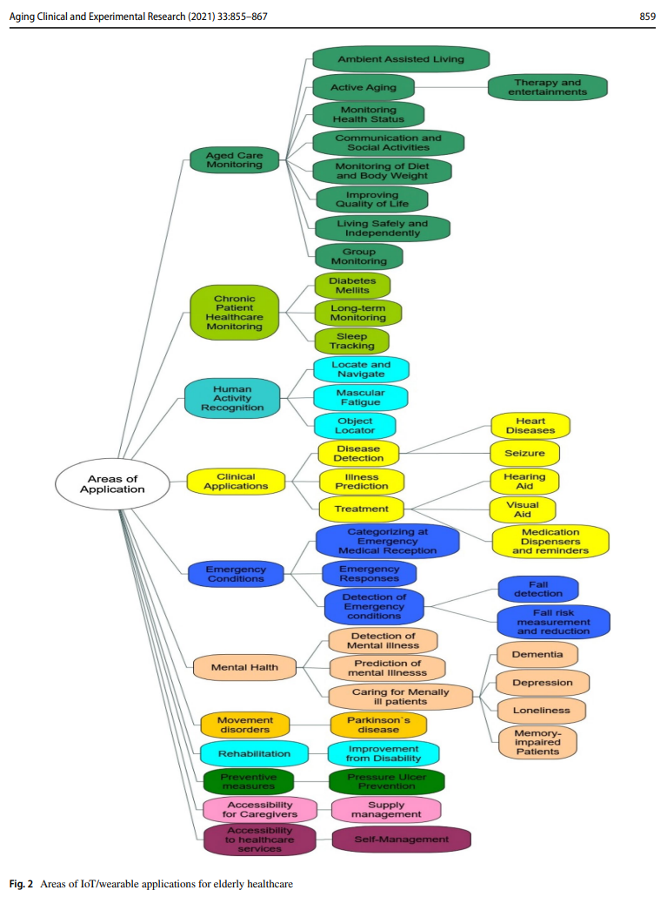
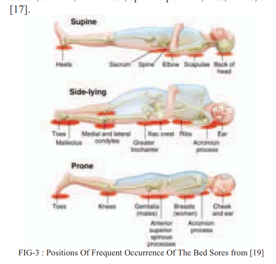
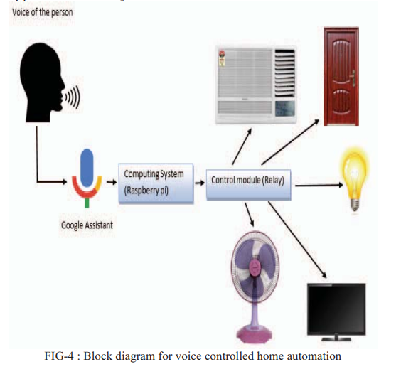

# Readings

## Towards an Integration of "SmartHome" (2020)

K. Elloumi, N. Ayadi, H. Medhaffar and D. Ben Halima Abid, "Towards an Integration of “SmartHome” Technology in Education: Realization of a didactic platform," 2020 17th International Multi-Conference on Systems, Signals & Devices (SSD), 2020, pp. 338-342, [doi](https://doi-org.proxy1.ncu.edu/10.1109/SSD49366.2020.9364238). [IntegrationSmartHome](IntegrationSmartHome.pdf).

The authors discuss the growing interest in smarthomes, which _consists essentially on recognition of the requirements of a smart house in terms of energy management, security and comfort._.  

However, its  challenging for general users to building with these systems.  These issues exist because graduate students must understand networking, sensors, embedded systems, and related concepts.  Their solution mitigates these issues with a `smarthouse operating system`.

### How does the didactic (teaching) system work

> This paper deals with designing and controlling of a `didactic smart home model` through implementation of home automation applications. Treated applications are essentially:

- Lighting management
- Access control to the house and the garage
- Air conditioning and heating management
- Management of alarms and alerts in real time: temperature alert, gas alert and smoke alert
- Management of opening and closing of window shutters
- Management of irrigation system
- Fire and gas leak detection

Users can send text messages to an Ardunio controller and change different configuration details.  For instance, placing the home in "winter or summer" mode changes the humdity, temperature, and irrigation settings.

The authors use a CNC machine to print a "small house" (~1 cubic foot); and then connect everything to Andrino controllers.

## Toyota Smarthome (2019)

S. Das et al., "Toyota Smarthome: Real-World Activities of Daily Living," 2019 IEEE/CVF International Conference on Computer Vision (ICCV), 2019, pp. 833-842, [doi](https://doi-org.proxy1.ncu.edu/10.1109/ICCV.2019.00092). [ToyotaSmarthome](ToyotaSmarthome.pdf).

Essentially the authors record 16K videos of seniors operating within an elderly care center.  Those videos contain RGB+D data (see [Litomisky, 2012](RGBD-intro.pdf)) (e.g., Microsoft Kinect Sensor).  Researchers can use this information to build models for predicting `daily activities within the home`.

> Most of the large activity recognition datasets consist of data sourced from the web, which does not reflect challenges that exist in activities of daily living. In this paper, we introduce a large real-world video dataset for activities of daily living: Toyota Smarthome. `The dataset consists of 16K RGB+D clips of 31 activity classes, performed by seniors in a smarthome. Unlike previous datasets, videos were fully unscripted`.
>[...]
> As a result, the dataset poses several challenges: high intra-class variation, high class imbalance, simple and composite activities, and activities with similar motion and variable duration. Activities were annotated with both coarse and fine-grained labels. These characteristics differentiate Toyota Smarthome from other datasets for activity recognition.
>[...]
> Most available activity recognition datasets [...] introduce data bias as they mainly contain activities concerning sports, outdoor activities and playing instruments.

### What did Toyota do

The frames feed into a 3D ConvNet, that accounts for spatiotemporal space.

> To address the real-world challenges in Smarthome, we propose a novel attention mechanism on top of currently high-performing spatio-temporal convolutional networks [4] (3D ConvNet). Inspired by [11], our method uses both spatial and temporal attention mechanisms. We dissociate the spatial and temporal attention mechanisms (instead of coupling them).

### What challenges did Toyota encounter

Real-world datasets are `out-of-frame, low-resolution, and low-frame count`.  The video duration also tends to be fairly short.  These issues make web-based training data (e.g., YouTube) incompatible with Smarthome RTSP cameras.

Further, its challenging to encode the time and space movement.  Researchers devise various algorithms (e.g., Two-stream ConvNet), however, these fall apart with large data volumes.  There needs to be more attention to feature selection in these areas.

They address these issues with I3D (Image DataSet for Denoising and Demosaicing)-based algorithms.

## I3D: a new dataset for testing denoising and demosaicing algorithms (2020)

Bonanomi, C., Balletti, S., Lecca, M. et al. I3D: a new dataset for testing denoising and demosaicing algorithms. Multimed Tools Appl 79, 8599–8626 (2020). [doi](https://doi-org.proxy1.ncu.edu/10.1007/s11042-018-6396-4). [I3D.pdf](I3D.pdf).

When cameras capture a frame, there is an encoding from RGB to CFA (Color Filter Array) that introduces variability in lighting and color values.  Researchers mitigates these issues with I3D algorithms that seek to reduce the variability between two frames.

Typically Demosaicing (frame construction) and Denoising (external noise) are seperate processes.  The authors propose a mechanism that unifies both scenarios within the same broader operation.

## Face Recognition Applied for Smarthome Using SoC (2019)

M. S. Nguyen, N. V. Huynh, D. D. Tran and H. T. Ngo, "An Approach of Face Recognition Applied for Smarthome Using System – on – Chip Technology," 2019 International Conference on Advanced Computing and Applications (ACOMP), 2019, pp. 165-170, [doi](https://doi-org.proxy1.ncu.edu/10.1109/ACOMP.2019.00033). [Facial_via_SoC](Facial_via_SoC.pdf).

The authors build an FGPA module that can perform [Haar feature-based cascade classifiers](https://medium.com/analytics-vidhya/haar-cascades-explained-38210e57970d) [[Cached](HaarCascadesExplained)].  Essentially, these are the reason that Keras CNN algorithms use [MaxPooling](https://keras.io/api/layers/pooling_layers/max_pooling2d/).

Their solution detects a face within frame <=250ms from 1 meter distance.

## Alexa Eldercare Toolbox (2020)

K. Tan, K. Sekhar, J. Wong, J. Holgado, M. Ameer and G. Vesonder, "Alexa Eldercare Toolbox: A Smarthome Solution for the Elderly," 2020 11th IEEE Annual Ubiquitous Computing, Electronics & Mobile Communication Conference (UEMCON), 2020, pp. 0806-0812, [doi](https://doi-org.proxy1.ncu.edu/10.1109/UEMCON51285.2020.9298127). [ElderCareToolbox](ElderCareToolbox.pdf).

> This paper examines the issue of providing care to an increasing elderly population presenting a `strong desire to continue living at home`. [...] According to the Population Reference Bureau, the number of Americans aged 65 and older is expected to approximately double by the year 2060, based on figures from 2018. With 95 million people, the `65-and-older group will make up about 23% of the total population` [17]. Moreover, as it is now, `one in ten people aged 65 and older has Alzheimer’s disease`.

The authors present 13 Amazon Alexa skills that assist with changes to Alzheimer's routines.  These essentially serve as a purpose-built checklist of medical instructions.

### Challenges with Eldercare Toolbox

The service assumes that patients with Alzheimers `remember` to use it.  This situation is unlikely to be the case for all patients.  Instead, mechanisms need to serve `more like a parent, less like a stenographer`.

Video monitoring services can fill this gap and provide those capabilities.

## IoT applications for elderly care (2021)

Tun, S. Y. Y., Madanian, S., & Mirza, F. (2021). Internet of things (IoT) applications for elderly care: a reflective review. Aging Clinical & Experimental Research, 33(4), 855–867. [doi](https://doi-org.proxy1.ncu.edu/10.1007/s40520-020-01545-9). [IoT_elderly_care](IoT_elderly_care.pdf).

The authors conduct a survey of IoT wearables, which extend the time seniors can live in resident.  This scenario has numerous caveats and introduces implementation risk.

### Any challenges/limitations

Focusing on wearable IoT provides solutions to many core scenarios.  However, elderly with (pre-)dimensia are unlikely to `remember` to wear those devices.  Instead, there needs to be mechanisms for detecting these scenarios without wearables.

### What scenarios use IoT + ElderlyCare

## Privacy Enhanced Cloud-Based Facial Recognition (2021)

Yang, T., Zhang, Y., Sun, J., & Wang, X. (2021). Privacy Enhanced Cloud-Based Facial Recognition. Neural Processing Letters, 1. [doi](https://doi-org.proxy1.ncu.edu/10.1007/s11063-021-10477-y) [PrivacyEnhancedFacialRecog](PrivacyEnhancedFacialRecog.pdf).

The authors recommend a client/server distributed model for homomorphic encryption.  This topology makes the notion of embedded system facial recognition more plausible in these low-resource environments.

## Google Duplex Artificial Intelligence Solution for Elderly Care (2019)

D. Ganesh, G. Seshadri, S. Sokkanarayanan, S. Rajan and M. Sathiyanarayanan, "IoT-based Google Duplex Artificial Intelligence Solution for Elderly Care," 2019 International Conference on contemporary Computing and Informatics (IC3I), 2019, pp. 234-240, [doi](https://doi-org.proxy1.ncu.edu/10.1109/IC3I46837.2019.9055551). [GoogleDuplex](GoogleDuplex.pdf).

The authors describe a "smartbed" that uses to determine the state of the person.

### How do users interact with the system

Users outside of the "smart pajamas" need to use voice communication

